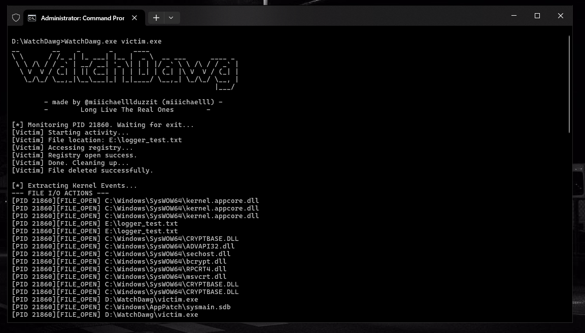

# WatchDawg: Lightweight ETW-based behavioral monitor for dynamic malware analysis.

WatchDawg leverages Windows Kernel Event Tracing (ETW) to capture file I/O and registry activity generated by a target process. It is designed for analysts who want a minimal, native, no-driver approach to behavioral inspection.



---

## Overview

WatchDawg:

* Launches a target executable in suspended state
* Attaches to the Windows Kernel Logger session
* Enables File I/O and Registry tracing
* Monitors activity until the process exits
* Parses the generated ETL trace
* Outputs filtered events for the monitored PID
* Produces a concise summary of behavioral activity

It acts as a lightweight alternative to tools like Process Monitor, focused specifically on controlled single-process analysis.

---

## Why ETW?

Event Tracing for Windows (ETW) provides:

* Kernel-level visibility
* Low overhead
* No API hooking
* No driver required
* High reliability
* Native Windows telemetry

This makes it ideal for dynamic malware analysis and sandbox-style behavioral observation.

---

## Features

* Kernel-level File I/O tracing
* Kernel-level Registry tracing
* NT path → DOS path resolution
* PID-based filtering
* Suspended process launch for clean capture
* Automatic session cleanup
* Summary statistics

---

## How It Works

1. Stops any existing Kernel Logger session
2. Starts a new ETW kernel session with:

   * `EVENT_TRACE_FLAG_FILE_IO`
   * `EVENT_TRACE_FLAG_FILE_IO_INIT`
   * `EVENT_TRACE_FLAG_REGISTRY`
3. Launches the target executable suspended
4. Resumes execution
5. Waits for process termination
6. Stops tracing
7. Parses the generated ETL file
8. Filters events by the monitored PID
9. Outputs File and Registry actions

---

## Example Output

```
--- FILE I/O ACTIONS ---
[PID 4820][FILE_OPEN] C:\Users\Public\payload.dll
[PID 4820][FILE_WRITE] C:\Users\Public\payload.dll

--- REGISTRY ACTIONS ---
[PID 4820][REG_ACCESS] HKCU\Software\Microsoft\Windows\CurrentVersion\Run

================ SUMMARY ================
Total File Events Captured: 12
Total Registry Events Captured: 4
=========================================
```

---

## Use Cases

* Malware behavior profiling
* Suspicious binary triage
* Payload detonation in lab environments
* Persistence mechanism detection
* Ransomware file activity inspection
* Registry modification auditing
* Educational Windows internals research

---

## Requirements

* Windows 10 / 11
* Administrator privileges (required for kernel tracing)
* Visual Studio (or compatible C compiler)
* `tdh.lib`
* `advapi32.lib`

---

## Build Instructions

Using Visual Studio:

1. Create a new Console Application project
2. Add the source file
3. Link against:

   * `tdh.lib`
   * `advapi32.lib`
4. Build in x64 (recommended)

Or using MSVC:

```
cl watchdawg.c /link tdh.lib advapi32.lib
```

---

## Usage

```
WatchDawg.exe <target.exe>
```

Example:

```
WatchDawg.exe sample.exe
```

You must run the program as Administrator.

---

## Limitations

* Requires administrative privileges
* Limited registry opcode coverage
* No network telemetry
* Single-process monitoring only
* Events are stored in memory before printing
These limitations may get lesser as I work on the project.
---

## Security Notice

This tool is intended for:

* Defensive security research
* Malware analysis in controlled environments
* Educational purposes

Do not use against systems you do not own or have permission to test.

---

## Disclaimer

This software is provided for educational and research purposes only. The author is not responsible for misuse or damage caused by this tool.
